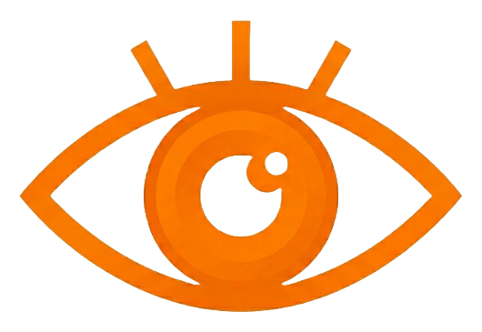

<p align="center">
  
  <br>
  <b>Watch Out</b>
</p>

Final Project repository for **AREA-42** (formerly Team 7) — Data & AI Cohort.

> **Project status:** idea approved, technical planning in progress.
> The components described below are **planned**, not yet implemented. This
> repository currently contains the project structure, documentation, and
> placeholders for the work ahead.
>
> **Technical direction:** the current direction is **API-first** — the MVP uses
> an external NVIDIA model through an API key rather than training a custom
> model. See [`docs/PROJECT_CONTEXT.md`](docs/PROJECT_CONTEXT.md) and
> [`docs/ARCHITECTURE.md`](docs/ARCHITECTURE.md).

---

## Problem

Workplaces such as construction sites, warehouses, and factories require workers
to wear personal protective equipment (PPE) — helmets, vests, gloves, goggles,
boots. Manual monitoring through CCTV is slow, inconsistent, and hard to scale.
Safety violations are often noticed too late, only after an incident has already
happened.

## Proposed Solution

An **AI-powered workplace safety monitoring system** that analyzes video streams
and automatically detects PPE compliance in real time. When a worker is missing
required equipment for a sustained period, the system records the incident and
notifies the responsible people, so violations are caught as they happen rather
than after the fact.

## MVP Scope

The Minimum Viable Product (MVP) aims to demonstrate the end-to-end pipeline on a
single video source:

- **In scope (MVP)**
  - Ingest a video file (or single camera stream).
  - Sample frames and send them to an **external NVIDIA model via API** for
    inference (the specific model and API details are TBD; see
    [`docs/ARCHITECTURE.md`](docs/ARCHITECTURE.md)).
  - Interpret the response into PPE / safety violations.
  - Apply persistent-violation logic (a violation must last a sustained period
    before it counts, to reduce false alarms).
  - Capture an incident snapshot/clip when a confirmed violation occurs.
  - Send a basic notification for confirmed incidents.
  - Expose results through a simple API and a basic monitoring UI.
  - Training a custom model and a full training dataset are **not** required for
    this MVP; a small evaluation set is still used (see
    [`docs/ASSET_POLICY.md`](docs/ASSET_POLICY.md)).

- **Out of scope (for now)**
  - Multi-camera scaling and load balancing.
  - Advanced analytics, dashboards, and reporting.
  - User accounts, roles, and permissions.
  - Production-grade deployment and high availability.

## High-Level Architecture

> All stages below are **planned** and **API-first**. The full proposed pipeline,
> dependency boundary, and failure/privacy considerations are documented in
> [`docs/ARCHITECTURE.md`](docs/ARCHITECTURE.md).

```text
Video Input  ─►  Frame Sampling  ─►  NVIDIA Model API  ─►  Violation Rules
                                                              │
                                                              ▼
                                  Incident Capture  ◄──  Persistent Violation Logic
                                         │
                                         ▼
                                   Notifications
                                         │
                                         ▼
                        API  ─────────►  Monitoring UI
```

| Stage                 | Responsibility                                                    | Planned location      |
| --------------------- | ---------------------------------------------------------------- | --------------------- |
| Video input           | Read frames from files / streams                                 | `src/video/`          |
| Detection (API)       | Sample/preprocess frames, call the external NVIDIA model API, normalize the response | `src/detection/`      |
| Person tracking       | Assign stable IDs to people across frames (proposed)             | `src/tracking/`       |
| Violation rules       | Decide what counts as a violation and when it is "persistent"    | `src/rules/`          |
| Incident capture      | Save frames/clips and incident metadata                         | `src/incidents/`      |
| Notifications         | Alert responsible people about confirmed incidents              | `src/notifications/`  |
| API                   | Expose incidents and system status                              | `src/api/`            |
| Monitoring UI         | Visualize live status and incident history                      | `src/ui/`             |

## Repository Structure

```text
src/
  video/          # video input / frame reading (planned)
  detection/      # PPE & person detection (planned)
  tracking/       # person tracking across frames (planned)
  rules/          # violation & persistent-violation logic (planned)
  incidents/      # incident capture (frames/clips + metadata) (planned)
  notifications/  # alerts / notifications (planned)
  api/            # backend API (planned)
  ui/             # monitoring UI (planned)

configs/          # configuration files (planned)
data/             # local datasets (git-ignored; see data/README.md)
models/           # model weights & checkpoints (git-ignored; see models/README.md)
notebooks/        # exploration & experiments (planned)
tests/            # automated tests (planned)
scripts/          # helper / utility scripts (planned)
docs/             # project & team documentation
```

> Empty planned directories are kept with `.gitkeep` files. Datasets, model
> weights, videos, runtime outputs, and secrets are intentionally **not**
> committed (see [`.gitignore`](.gitignore)).

## Setup

> _Placeholder — to be completed once the implementation begins._

```bash
# 1. Clone the repository
git clone https://github.com/area42-ai/AREA-42-Final-project.git
cd AREA-42-Final-project

# 2. Create and activate a virtual environment
#    (instructions TBD)

# 3. Install dependencies
#    (dependency file TBD)
```

## Usage

> _Placeholder — to be completed once the pipeline is implemented._

```bash
# Example (planned, not yet available):
# python -m src.api        # start the backend API
# python -m src.ui         # start the monitoring UI
```

## Brand Identity

**Watch Out** is designed to act as an extra pair of vigilant eyes in the workplace, utilizing AI computer vision to monitor and ensure worker compliance with required Personal Protective Equipment (PPE). The brand identity reflects safety, vigilance, and real-time responsiveness.

### Core Brand Colors

| Color Role | Color Preview | HEX Value | Description |
|---|---|---|---|
| **Safety Orange** | `■` | `#fb7600` | The primary brand color, representing visibility, safety equipment, and active monitoring alerts. |
| **Dark Slate** | `■` | `#1e293b` | Used for backgrounds, text, and structure, offering high contrast and readability. |
| **White** | `■` | `#ffffff` | Clean contrast and highlight accents. |

## Team

- Roya Nasirova
- Adil Hasanov
- Elvin Nəsirov
- Aysu Mammadova Anar

## Project Documentation

- [Plan.md](Plan.md) — dynamic roadmap, tasks, owners, blockers
- [docs/PROJECT_CONTEXT.md](docs/PROJECT_CONTEXT.md) — product, scope, confirmed/proposed/TBD
- [docs/ARCHITECTURE.md](docs/ARCHITECTURE.md) — proposed API-first pipeline
- [docs/ASSET_POLICY.md](docs/ASSET_POLICY.md) — what may and may not be committed
- [docs/AI_WORKFLOW.md](docs/AI_WORKFLOW.md) — how AI tools and humans collaborate
- [docs/TEAM_WORKFLOW.md](docs/TEAM_WORKFLOW.md) — workflow and management strategy
- [docs/DECISIONS.md](docs/DECISIONS.md) — official decisions log
- [docs/MEETING_LOG.md](docs/MEETING_LOG.md) — meeting summaries
- [AGENTS.md](AGENTS.md) — instructions for AI coding agents

## Links

- **GitHub Project Board:** `https://github.com/orgs/area42-ai/projects/1/views/1`

## License

This project is licensed under the [MIT License](LICENSE).
